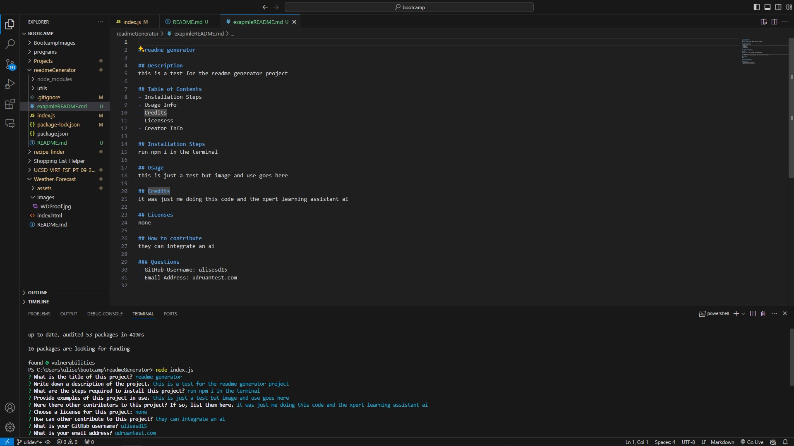

# README generator

## Description
This program creates and formats a professional readme file so that the user doesn't have to go through the hasstle of formatting the readme file.

## Table of Contents
- [Installation](#installation)
- [Usage](#usage)
- [Credits](#credits)
- [License](#license)
- [Questions](#questions)

## Installation
To run this project you need to install the inquirer package by running npm install in the command line then running node index.js to start the program.

## Usage

## Credits
There were no other contributors to this project, just me and the Xpert learning assistant AI.

## Licenses
none

## How to contribute
Others can implement an AI that would take even less input from the user and create an even more artifically generated readme file.

### Questions
- GitHub Username: ulisesd15
- Email Address: ulisesd404@gmail.com
